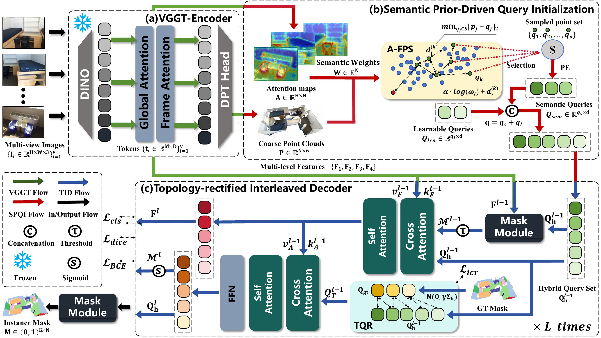

# VGGT-Seg: Visual Geometry Grounded Transformer for Sparse Multi-view 3D Instance Segmentation


<center>
  <i><b>Zeyu Wang, Wei Zhang, Jun Zhou, Qi Wang</b></i>
</center>


## Introduction
VGGT-Seg is an end-to-end 3D instance segmentation framework that operates solely on sparse multi-view image sequences without requiring explicit sensor-provided geometric inputs. This framework incorporates global semantic responses from visual foundation models via SPQI to alleviate the localization bias caused by sparse multi-view geometries, and introduces topology-rectified query rectification along with instance-centric rectified contrastive loss to address the supervision misalignment and geometric aliasing inherent in coarse point clouds.

<center>
  
</center>

## Installation

```bash
# Create conda environment
conda create -n VGGTseg python=3.10
conda activate VGGTseg

#Python 3.10 and PyTorch 2.3 are required.
pip install torch==2.3.1 torchvision==0.18.1 --index-url https://download.pytorch.org/whl/cu121
pip install -r requirements.txt
```

Download the frozen VGGT weights from Hugging Face:

```bash
huggingface-cli download facebook/VGGT-1B --local-dir checkpoints/VGGT-1B
```


## Data

Preparation instructions are in [docs/data.md](docs/data.md). The resulting layout is:

```text
data/<dataset>/
|- annotations/
|- labels/
|- train.json
`- val.json
```

Available configurations are `scannet`, `scannet200`, `ai2thor`, `matterport21`, and `matterport160`.

## Training

The paper setting uses four GPUs and a batch size of two per GPU.

```bash
bash scripts/train_vanilla.sh configs/scannet.yaml
bash scripts/train_full.sh configs/scannet.yaml
```

## Inference

Inference accepts RGB images only and adaptively selects at most 80 views. TQR and its ground-truth topology queries are disabled automatically.

```bash
bash scripts/infer_vanilla.sh configs/scannet.yaml CHECKPOINT IMAGE_DIR result.npz
bash scripts/infer_full.sh configs/scannet.yaml CHECKPOINT IMAGE_DIR result.npz
```


#### If you find VGGT-Seg useful, please help ⭐ this repo, which is important to Open-Source projects. Thanks!
